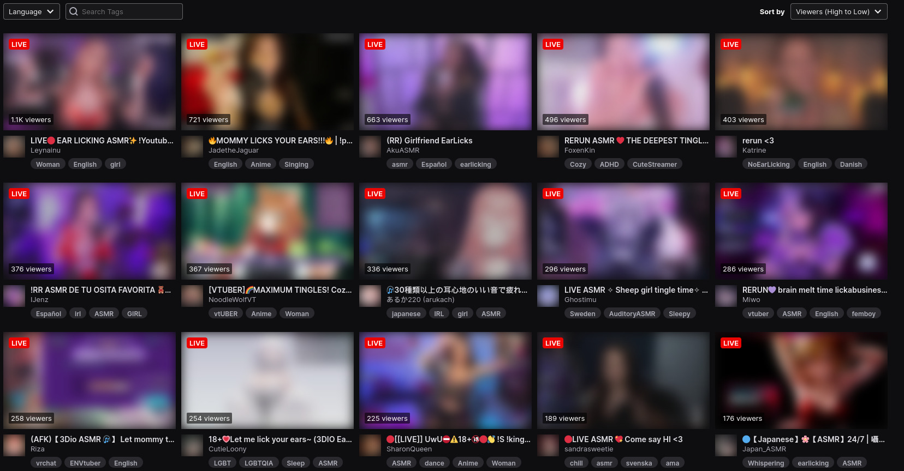
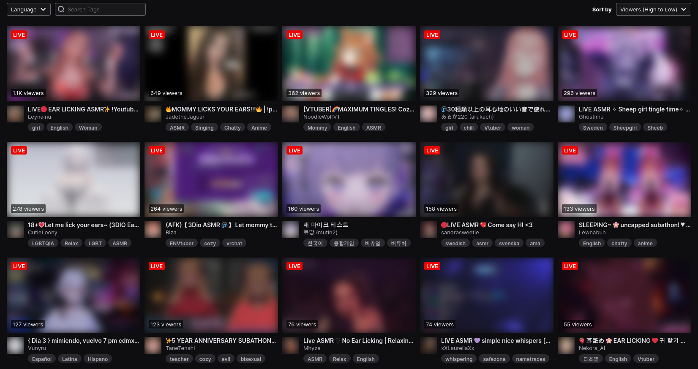

# Userscript: Hide Twitch Channels

[Link to userscript](./hide-twitch-channels.userscript.js)

This comes preconfigured for the ASMR category because that's what I use it for. You can change the list of channels in the script.

Before:

After:

